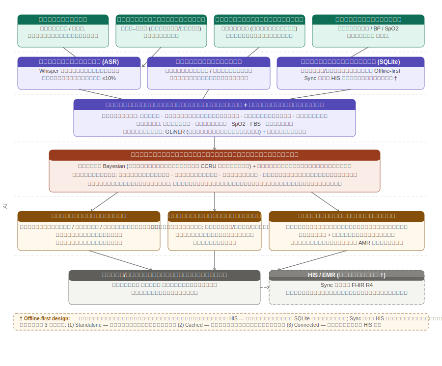
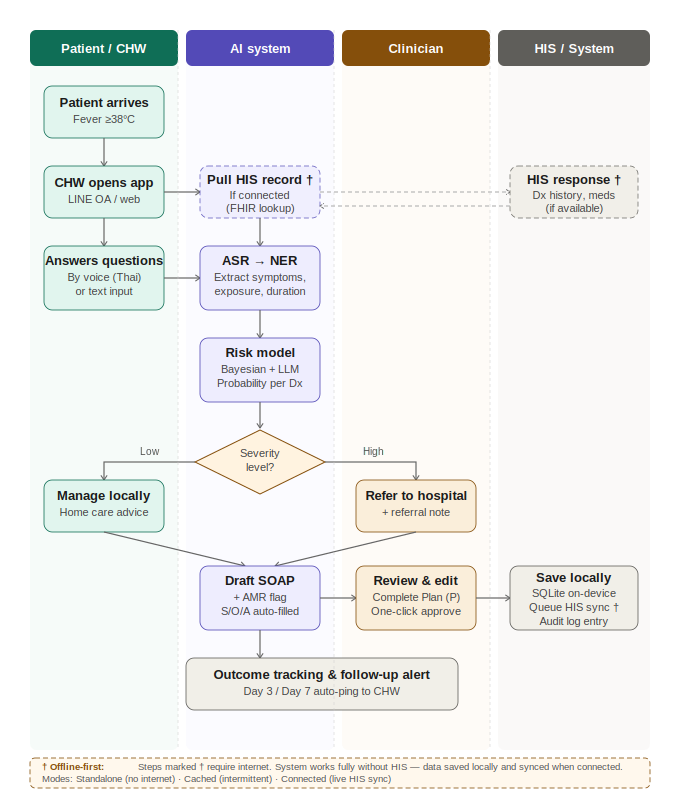

# ข้อเสนอโครงการวิจัย — กรอกระบบ NRIIS (สวรส. ปีงบประมาณ 2570)

> แต่ละหัวข้อด้านล่างตรงกับช่องกรอกข้อมูลในระบบ NRIIS — คัดลอกเนื้อหาใต้แต่ละหัวข้อไปวางในช่องที่ตรงกัน

---

## ช่อง: ชื่อโครงการ (ภาษาไทย)

ระบบคัดกรองไข้เฉียบพลัน (Acute Febrile Illness) ด้วยปัญญาประดิษฐ์ในพื้นที่ห่างไกล จังหวัดเชียงราย ภาคเหนือของประเทศไทย

---

## ช่อง: ชื่อโครงการ (ภาษาอังกฤษ)

Artificial Intelligence (AI)-Assisted Screening for Acute Febrile Illness in Remote Areas, Chiang Rai, Northern Thailand

---

## ช่อง: คำสำคัญ (ภาษาไทย)

ไข้เฉียบพลัน, ระบบสนับสนุนการตัดสินใจทางคลินิก, ปัญญาประดิษฐ์, การประมวลผลภาษาธรรมชาติ, NLP ภาษาไทย, การดูแลการใช้ยาปฏิชีวนะ, การดื้อยาต้านจุลชีพ, อาสาสมัครสาธารณสุขประจำหมู่บ้าน, สถาปัตยกรรม Offline-first, การดูแลสุขภาพปฐมภูมิ, เชียงราย

---

## ช่อง: คำสำคัญ (ภาษาอังกฤษ)

Acute Febrile Illness, Clinical Decision Support System, Artificial Intelligence, Natural Language Processing, Thai-language NLP, Antibiotic Stewardship, Antimicrobial Resistance, Community Health Workers, Offline-first Architecture, Primary Care, Chiang Rai

---

## ช่อง: สถาบันหลัก

มหาวิทยาลัยแม่ฟ้าหลวง (MFU) — สำนักวิชาเทคโนโลยีดิจิทัลประยุกต์ (ADT)

---

## ช่อง: สถาบันพันธมิตร / หน่วยงานร่วมวิจัย

หน่วยวิจัยทางคลินิกเชียงราย (CCRU) / มหิดล ออกซ์ฟอร์ด หน่วยวิจัยเวชศาสตร์เขตร้อน (MORU)

---

## ช่อง: แนวทางร่วมดำเนินการ — หน่วยงานร่วมดำเนินการ/ภาคเอกชนหรือชุมชนที่ร่วมลงทุนหรือดำเนินการ

หน่วยงานร่วมดำเนินการ: มหิดล ออกซ์ฟอร์ด หน่วยวิจัยเวชศาสตร์เขตร้อน (MORU) ผ่านหน่วยวิจัยทางคลินิกเชียงราย (CCRU)

รูปแบบความร่วมมือ: สัญญาช่วง (Subcontract) ภายใต้สัญญาความร่วมมือวิจัย MFU-MORU ตามระเบียบ สวรส. ข้อ 3.2.3 ว่าด้วยสัญญาช่วง โดย MFU เป็นสถาบันหลักผู้รับทุนและเป็นผู้บริหารงบประมาณทั้งหมด

มูลค่าสัญญาช่วง CCRU/MORU: 450,000 บาท (11.3% ของงบประมาณรวม)

ทรัพยากรที่ CCRU/MORU ร่วมลงทุน/ดำเนินการ:
1. ชุดข้อมูลย้อนหลัง AFI ที่มีการวินิจฉัยยืนยัน (>500 ราย) — ทรัพย์สินทางปัญญาที่ CCRU สะสมมากว่า 10 ปี ส่งมอบภายใต้ Data Sharing Agreement (DSA) โดยไม่คิดค่าใช้จ่ายเพิ่มเติม
2. เครือข่ายโรงพยาบาลระดับอำเภอ 3–5 แห่งในเชียงราย — CCRU ประสานงานและอำนวยความสะดวกการเข้าถึงสถานที่ตรวจสอบภาคสนาม
3. ผู้ช่วยวิจัยภาคสนาม (Field RA) 1 คน — ดูแลการลงทะเบียนผู้เข้าร่วมและประสานงานในพื้นที่ (เงินเดือนจากสัญญาช่วง 250,000 บาท)
4. ความเชี่ยวชาญทางคลินิกของ Dr. Carlo Perrone — ตรวจทาน CDSS rules, ทบทวนโปรโตคอล UAT, ให้ข้อเสนอแนะทางคลินิก (ในฐานะผู้ร่วมวิจัย ไม่มีค่าตอบแทนเพิ่มเติม)
5. โครงสร้างพื้นฐานด้านจริยธรรม — CCRU/MORU ดำเนินการขอทบทวนจริยธรรมผ่าน Oxford Tropical Research Ethics Committee (OxTREC) โดยรับภาระค่าใช้จ่ายเอง
6. สังกัดออกซ์ฟอร์ด/เวลคัม — เพิ่มความน่าเชื่อถือทางวิชาการและเปิดเส้นทางทุนวิจัยต่อเนื่อง (Wellcome Trust)

ผลประโยชน์ร่วม: CCRU/MORU ได้ร่วมเป็นผู้เขียน (co-authorship) ในบทความวิจัย, ได้เครื่องมือ AI-CDSS สำหรับใช้ในเครือข่ายของตน, และได้ข้อมูลเชิงคาดการณ์ชุดใหม่ (≥150 ราย) เพิ่มเติมจากการตรวจสอบภาคสนาม

---

## ช่อง: หัวหน้าโครงการ

รศ. ดร. นชา ชลดำรงกุล (คณบดี สำนักวิชาเทคโนโลยีดิจิทัลประยุกต์) — nacha.cho@mfu.ac.th | 0 5391 6744

---

## ช่อง: ผู้ร่วมวิจัย

1. ผศ. ดร. ภัทรมน วุฒิพิทยามงคล — MFU สำนักวิชา ADT — ผู้ร่วมวิจัยหลัก (Co-PI) — ความเชี่ยวชาญ: AI/ML, สุขภาพดิจิทัล, สารสนเทศสุขภาพ
2. Dr. Carlo Perrone — CCRU/MORU เชียงราย — ผู้ร่วมวิจัย — ความเชี่ยวชาญ: ไข้เฉียบพลัน, AMR, สครับไทฟัส, เวชศาสตร์เขตร้อน

---

## ช่อง: กรอบงานวิจัย สวรส.

3.1.1 — เพิ่มประสิทธิภาพบริการสุขภาพด้วยเทคโนโลยีทางการแพทย์
3.1.2 — วิจัยการจัดการการดื้อยาต้านจุลชีพ (AMR)

---

## ช่อง: ระยะเวลาโครงการ

12 เดือน (ตุลาคม 2569 – กันยายน 2570) ปีงบประมาณ 2570

---

## ช่อง: งบประมาณรวม (บาท)

3,985,200

---

## ช่อง: สถานที่ดำเนินการวิจัย

โรงพยาบาลระดับอำเภอในเครือข่าย CCRU เชียงราย 3–5 แห่ง (การตรวจสอบเชิงคาดการณ์ ระยะที่ 2) + มหาวิทยาลัยแม่ฟ้าหลวง; วางแผนขยายไปยัง รพ.สต. หลังการตรวจสอบสำเร็จ

---

## ช่อง: ระดับความพร้อมของเทคโนโลยี (TRL)

TRL เริ่มต้น: 3 (หลักฐานแนวคิด)
TRL เป้าหมาย: 6 (ต้นแบบภาคสนามที่ผ่านการตรวจสอบ)

---

# ═══════════════════════════════════════════════════════════════
# ส่วนที่ 1: บทสรุปข้อเสนอโครงการ (ไม่เกิน 3,000 คำ)
# ═══════════════════════════════════════════════════════════════

## ช่อง: บทสรุปข้อเสนอโครงการ

ไข้เฉียบพลัน (Acute Febrile Illness: AFI) เป็นสาเหตุหลักของการเจ็บป่วยและการเสียชีวิตที่ป้องกันได้ในชุมชนชนบทภาคเหนือของประเทศไทย โดยเฉพาะในกลุ่มประชากรชาติพันธุ์บนพื้นที่สูงที่มีข้อจำกัดในการเข้าถึงบริการสุขภาพ โรคหลักที่พบในพื้นที่นี้ ได้แก่ โรคสครับไทฟัส (scrub typhus) ไข้เลือดออก (dengue haemorrhagic fever) โรคเลปโตสไปโรซิส (leptospirosis) และภาวะแบคทีเรียในเลือด/ภาวะติดเชื้อในกระแสเลือด (bacteraemia/sepsis)

ช่องว่างที่สำคัญในระดับการดูแลสุขภาพปฐมภูมิคือ อาสาสมัครสาธารณสุขประจำหมู่บ้าน (อสม.) และพยาบาลที่โรงพยาบาลส่งเสริมสุขภาพตำบล (รพ.สต.) ขาดเครื่องมือสนับสนุนการตัดสินใจที่ใช้งานได้จริงในการพิจารณาว่าผู้ป่วยไข้รายใดควรส่งต่ออย่างเร่งด่วน และรายใดสามารถดูแลรักษาในพื้นที่ได้อย่างปลอดภัย ความไม่แน่นอนในการวินิจฉัยนี้ยังนำไปสู่การสั่งยาปฏิชีวนะที่ไม่เหมาะสม ซึ่งส่งเสริมรูปแบบการดื้อยาต้านจุลชีพ (AMR) ที่ CCRU ได้บันทึกไว้ในจังหวัดเชียงราย

จากการทบทวนวรรณกรรมและบริบทระบบสุขภาพไทย พบว่า: (1) ยังไม่มีระบบสนับสนุนการตัดสินใจทางคลินิก (CDSS) ภาษาไทยสำหรับ AFI ที่ออกแบบสำหรับสถานพยาบาลที่มีทรัพยากรจำกัด (2) AI สุขภาพที่มีอยู่ในประเทศไทยมุ่งเน้นที่การวิเคราะห์ภาพทางการแพทย์เป็นหลัก มากกว่าการวินิจฉัยแยกโรคติดเชื้อ (3) CCRU/MORU ถือครองชุดข้อมูลทางคลินิก AFI และ AMR ที่ครอบคลุมที่สุดในภูมิภาค ครอบคลุมข้อมูลย้อนหลังมากกว่า 2,000 ราย จากจังหวัดเชียงราย พร้อมการวินิจฉัยยืนยัน ผลตรวจทางห้องปฏิบัติการ ข้อมูลระบาดวิทยา และผลลัพธ์การรักษา ซึ่งเป็นแหล่งข้อมูลฝึกสอนและแหล่ง Bayesian Prior ที่มีคุณค่าอย่างยิ่ง และ (4) มหาวิทยาลัยแม่ฟ้าหลวงมีความเชี่ยวชาญที่ได้รับการพิสูจน์แล้วด้าน AI และ NLP ภาษาไทย

วัตถุประสงค์หลักคือพัฒนาและประเมินประสิทธิผลของระบบสนับสนุนการตัดสินใจทางคลินิกด้วยปัญญาประดิษฐ์ (AI-CDSS) สำหรับคัดกรองผู้ป่วยไข้เฉียบพลันในระดับการดูแลสุขภาพปฐมภูมิในพื้นที่ห่างไกลของจังหวัดเชียงราย โดยอาสาสมัครสาธารณสุขสามารถใช้งานได้ในภาคสนาม วัตถุประสงค์รองประกอบด้วย: (1) พัฒนาโมดูล Clinical NLP ภาษาไทย (2) ออกแบบสัญญาณ Antibiotic Stewardship (3) ประเมินการใช้งานที่โรงพยาบาลระดับอำเภอในเครือข่าย CCRU และ (4) สร้างระบบบนสถาปัตยกรรม Offline-first

ระบบใช้สถาปัตยกรรม 5 ชั้น: ชั้นที่ 1 รับข้อมูลจากเสียงพูดภาษาไทย (Whisper fine-tuned, WER เป้าหมาย ≤10%) แบบสอบถาม สัญญาณชีพ และประวัติจาก HIS; ชั้นที่ 2 สกัดข้อมูลทางคลินิกด้วย NER แบบ zero-shot (GLiNER); ชั้นที่ 3 ประเมินความเสี่ยงโดยผสม Bayesian Prior จากข้อมูล CCRU กับ LLM reasoning ให้คะแนนความน่าจะเป็นสำหรับ 4 โรคเป้าหมายพร้อม AMR Stewardship Signal; ชั้นที่ 4 แพทย์/พยาบาลทบทวนและอนุมัติก่อนบันทึกลง SQLite บนอุปกรณ์พร้อม FHIR R4 sync; และชั้นที่ 5 แจ้งเตือนติดตามอัตโนมัติวันที่ 3 และ 7 (ดูรูปที่ 3-1 และ 3-2)

การดำเนินงานแบ่งเป็น 4 ระยะ ครอบคลุม 12 เดือน: ระยะที่ 0 (เดือน 1–2) ยื่น IRB และจัดทำ DSA กับ CCRU; ระยะที่ 1 (เดือน 3–5) พัฒนาโมเดล AI; ระยะที่ 2 (เดือน 6–10) ตรวจสอบภาคสนามที่โรงพยาบาลระดับอำเภอ 3–5 แห่ง กับผู้ป่วย ≥150 ราย; และระยะที่ 3 (เดือน 11–12) เผยแพร่ผลงาน

โรงพยาบาลระดับอำเภอได้รับเลือกเป็นสถานที่ตรวจสอบเนื่องจากบุคลากรเจาะเลือดได้ ทำให้สามารถวินิจฉัยยืนยันด้วยมาตรฐานอ้างอิง (PCR/ซีรัมวิทยา/การเพาะเชื้อ) สอดคล้องกับวิธีเก็บข้อมูลย้อนหลังของ CCRU หลังตรวจสอบสำเร็จจะปรับใช้ที่ระดับ รพ.สต.

งบประมาณรวม 3,985,200 บาท ตามโครงสร้าง 5 หมวด สวรส.: หมวด 1 ค่าตอบแทนบุคลากร 1,026,000 บาท (29.9%, เพดาน ≤30%); หมวด 2 ค่าบริหารจัดการ 303,000 บาท (8.8%, เพดาน ≤15%); หมวด 3 ค่าดำเนินงาน 2,103,000 บาท (รวมสัญญาช่วง CCRU/MORU 450,000 บาท); หมวด 4 ค่าครุภัณฑ์ 210,000 บาท; หมวด 5 ค่าธรรมเนียมสถาบัน 343,200 บาท (10.0%, เพดาน ≤10%)

ตัวชี้วัดสำคัญ: Sensitivity ≥85%, Specificity ≥75%, ลดการใช้ยาปฏิชีวนะไม่เหมาะสม ≥15%, Usability score ≥70/100, WER ≤10%, ผู้ป่วยที่ตรวจสอบ ≥150 ราย

ผลผลิตที่คาดหวัง: เครื่องมือคัดกรอง AI AFI ภาษาไทยแบบ Open-source (เว็บแอป + mobile), โมเดลรู้จำเสียงทางการแพทย์ภาษาไทย, ชุดข้อมูลผู้ป่วย AFI เปิด, บทความวิชาการ ≥1 ฉบับ, สรุปนโยบายสำหรับ สธ. และ สวรส. ผลกระทบระยะยาว: ลดความไม่เท่าเทียมด้านสุขภาพ, สนับสนุนแผนยุทธศาสตร์ AMR แห่งชาติ, โมเดลที่ขยายสู่ภูมิภาค GMS/ASEAN, เส้นทางขึ้นทะเบียน อย. เป็น SaMD, เส้นทางเข้าชุดสิทธิประโยชน์ สปสช.

จริยธรรมการวิจัย: ขอรับรองจาก MFU HREC และ CCRU/OxTREC, ผู้เข้าร่วมลงนามยินยอม, ข้อมูลไม่ระบุตัวตน, จัดทำ DSA, ระบบเป็นเครื่องมือสนับสนุนไม่ใช่ระบบวินิจฉัยอัตโนมัติ

โครงการนี้สอดคล้องกับกรอบวิจัย สวรส. ปีงบประมาณ 2570 ทั้งในด้าน 3.1.1 (เพิ่มประสิทธิภาพบริการสุขภาพด้วยเทคโนโลยีทางการแพทย์) และ 3.1.2 (วิจัยการจัดการ AMR) โดยมีสัญญาณ Antibiotic Stewardship ฝังในระบบ สอดคล้องกับแผนยุทธศาสตร์ AMR แห่งชาติ พ.ศ. 2566–2570

---

# ═══════════════════════════════════════════════════════════════
# ส่วนที่ 2: หลักการและเหตุผล / ปัญหา / โจทย์การวิจัย (ไม่เกิน 3,000 คำ)
# ═══════════════════════════════════════════════════════════════

## ช่อง: หลักการและเหตุผล / ปัญหา / โจทย์การวิจัย

1.1 สถานการณ์ปัญหา

ไข้เฉียบพลัน (Acute Febrile Illness: AFI) เป็นสาเหตุหลักของการเจ็บป่วยและการเสียชีวิตที่ป้องกันได้ในชุมชนชนบทภาคเหนือของประเทศไทย โดยเฉพาะในกลุ่มประชากรชาติพันธุ์บนพื้นที่สูงที่มีข้อจำกัดในการเข้าถึงบริการสุขภาพ โรคหลักที่พบในพื้นที่นี้ ได้แก่ โรคสครับไทฟัส (scrub typhus) ไข้เลือดออก (dengue haemorrhagic fever) โรคเลปโตสไปโรซิส (leptospirosis) และภาวะแบคทีเรียในเลือด/ภาวะติดเชื้อในกระแสเลือด (bacteraemia/sepsis) โรคเหล่านี้มีอาการเริ่มต้นที่คล้ายคลึงกัน ได้แก่ ไข้สูง ปวดศีรษะ ปวดเมื่อยกล้ามเนื้อ และอ่อนเพลีย ทำให้การวินิจฉัยแยกโรคในระดับปฐมภูมิเป็นเรื่องยากอย่างยิ่ง โดยเฉพาะเมื่อไม่มีผลตรวจทางห้องปฏิบัติการยืนยัน

ช่องว่างที่สำคัญในระดับการดูแลสุขภาพปฐมภูมิคือ อาสาสมัครสาธารณสุขประจำหมู่บ้าน (อสม.) และพยาบาลที่โรงพยาบาลส่งเสริมสุขภาพตำบล (รพ.สต.) ขาดเครื่องมือสนับสนุนการตัดสินใจที่ใช้งานได้จริงในการพิจารณาว่าผู้ป่วยไข้รายใดควรส่งต่อโรงพยาบาลอย่างเร่งด่วน และรายใดสามารถดูแลรักษาในพื้นที่ได้อย่างปลอดภัย ความไม่แน่นอนในการวินิจฉัยนี้นำไปสู่ผลเสีย 2 ประการ ได้แก่ (1) การส่งต่อล่าช้าของผู้ป่วยสครับไทฟัสและภาวะติดเชื้อในกระแสเลือดที่ต้องการการรักษาอย่างเร่งด่วน ซึ่งเพิ่มอัตราการเสียชีวิต และ (2) การสั่งยาปฏิชีวนะที่ไม่เหมาะสมเป็นวงกว้าง ซึ่งส่งเสริมรูปแบบการดื้อยาต้านจุลชีพ (Antimicrobial Resistance: AMR) ที่หน่วยวิจัยทางคลินิกเชียงราย (CCRU) ได้บันทึกไว้ในจังหวัดเชียงราย

จังหวัดเชียงรายมีลักษณะทางภูมิศาสตร์ที่ทำให้ปัญหานี้รุนแรงขึ้น: พื้นที่ส่วนใหญ่เป็นภูเขาและป่า ชุมชนกระจายตัวห่างไกลจากโรงพยาบาลอำเภอ เส้นทางคมนาคมยากลำบากโดยเฉพาะในฤดูฝน (ซึ่งเป็นช่วงที่มีผู้ป่วย AFI สูงสุด) และ รพ.สต. หลายแห่งไม่มีการเชื่อมต่ออินเทอร์เน็ตที่เสถียร ทำให้ไม่สามารถใช้ระบบ telemedicine หรือเข้าถึงฐานข้อมูลสุขภาพส่วนกลางได้ในเวลาที่ต้องการ

ข้อมูลจาก CCRU/MORU แสดงให้เห็นว่าในพื้นที่เชียงราย สครับไทฟัสเป็นสาเหตุหลักของ AFI ที่ต้องเข้ารับการรักษาในโรงพยาบาล และมีอัตราการเสียชีวิตสูงหากไม่ได้รับการรักษาด้วย doxycycline ทันเวลา ขณะเดียวกัน ไข้เลือดออกและเลปโตสไปโรซิสต้องการแนวทางการรักษาที่แตกต่างกันอย่างสิ้นเชิง การที่ อสม. และพยาบาล รพ.สต. ต้องตัดสินใจในสถานการณ์เช่นนี้โดยไม่มีเครื่องมือช่วยเหลือ ถือเป็นปัญหาเชิงระบบที่ส่งผลกระทบต่อทั้งผลลัพธ์ทางสุขภาพของผู้ป่วยและปัญหา AMR ระดับชาติ

1.2 ช่องว่างทางความรู้และนวัตกรรม

จากการทบทวนวรรณกรรมและบริบทระบบสุขภาพไทย พบช่องว่างสำคัญดังนี้:

ไม่มีระบบ CDSS ภาษาไทยสำหรับ AFI: ปัจจุบันยังไม่มีระบบสนับสนุนการตัดสินใจทางคลินิก (Clinical Decision Support System: CDSS) ภาษาไทยสำหรับไข้เฉียบพลันที่ออกแบบมาสำหรับสถานพยาบาลที่มีทรัพยากรจำกัด ระบบ CDSS ที่มีอยู่ในระดับสากล เช่น ALMANACH ของ Swiss TPH หรือ ePOCT เน้นบริบทแอฟริกาตะวันออกและไม่รองรับภาษาไทยหรือรูปแบบโรคเฉพาะของภาคเหนือประเทศไทย

AI สุขภาพไทยเน้นภาพทางการแพทย์: ระบบ AI สุขภาพที่มีอยู่ในประเทศไทยมุ่งเน้นการวิเคราะห์ภาพทางการแพทย์เป็นหลัก (เช่น Chest 4 All AI สำหรับเอกซเรย์ทรวงอก, ระบบคัดกรองเบาหวานจากจอประสาทตา) มากกว่าการวินิจฉัยแยกโรคติดเชื้อจากข้อมูลทางคลินิก ซึ่งเป็นความต้องการหลักในระดับปฐมภูมิ

ชุดข้อมูล CCRU/MORU ที่ไม่มีใครเทียบได้: CCRU/MORU ถือครองชุดข้อมูลทางคลินิก AFI และ AMR ที่ครอบคลุมที่สุดในภูมิภาค ครอบคลุมข้อมูลย้อนหลังมากกว่า 2,000 รายจากจังหวัดเชียงราย พร้อมการวินิจฉัยยืนยัน (PCR/ซีรัมวิทยา) ผลตรวจทางห้องปฏิบัติการ ข้อมูลระบาดวิทยา ผลทดสอบความไวของยาต้านจุลชีพ (AST) และผลลัพธ์การรักษา ข้อมูลเหล่านี้เป็นทรัพยากรที่มีคุณค่าอย่างยิ่งสำหรับการฝึกสอนโมเดล ML และเป็นแหล่ง Bayesian Prior ที่สะท้อนบริบทระบาดวิทยาเฉพาะพื้นที่ อย่างไรก็ตาม ข้อมูลเหล่านี้ยังไม่ได้ถูกนำมาใช้ในการพัฒนาเครื่องมือ AI สำหรับการดูแลสุขภาพระดับปฐมภูมิ

ความเชี่ยวชาญด้าน AI ภาษาไทยของ MFU: มหาวิทยาลัยแม่ฟ้าหลวงมีความเชี่ยวชาญที่ได้รับการพิสูจน์แล้วด้าน AI และ NLP ภาษาไทย โดยเฉพาะในด้าน speech recognition, named entity recognition และ machine learning สำหรับภาษาไทยทางการแพทย์ ซึ่งเป็นองค์ประกอบสำคัญที่ขาดหายในระบบ CDSS ที่พัฒนาจากต่างประเทศ

ช่องว่างด้านสถาปัตยกรรม Offline-first: ระบบ AI สุขภาพที่มีอยู่ส่วนใหญ่ต้องอาศัยการเชื่อมต่ออินเทอร์เน็ตอย่างต่อเนื่อง (cloud-dependent) ทำให้ไม่สามารถใช้งานได้ในพื้นที่ห่างไกลที่ขาดโครงสร้างพื้นฐานด้านโทรคมนาคม ยังไม่มีระบบ AI CDSS ที่ออกแบบมาเพื่อทำงานได้เต็มรูปแบบโดยไม่ต้องเชื่อมต่ออินเทอร์เน็ต พร้อมกับสามารถ sync ข้อมูลกับระบบ HIS เมื่อมีการเชื่อมต่อ

1.3 โจทย์การวิจัย

โจทย์หลักของการวิจัยนี้คือ: ระบบสนับสนุนการตัดสินใจทางคลินิกด้วยปัญญาประดิษฐ์ (AI-CDSS) ที่ใช้ภาษาไทย ทำงานแบบ Offline-first สามารถช่วยให้ อสม. และพยาบาลในพื้นที่ห่างไกลคัดกรองผู้ป่วยไข้เฉียบพลันได้อย่างแม่นยำและทันเวลา ลดการส่งต่อล่าช้าและการใช้ยาปฏิชีวนะที่ไม่เหมาะสมได้หรือไม่?

โจทย์ย่อยประกอบด้วย:
1. โมเดล NLP ภาษาไทยสามารถสกัดข้อมูลทางคลินิกจากเสียงพูดภาษาไทย (ทั้งภาษาไทยกลางและสำเนียงท้องถิ่น) ได้อย่างแม่นยำเพียงพอสำหรับการประเมินความเสี่ยง AFI หรือไม่? (WER ≤10%)
2. โมเดลความเสี่ยงที่ผสมผสาน Bayesian Prior จากข้อมูล CCRU กับ LLM reasoning สามารถให้ค่าความไว (sensitivity ≥85%) และความจำเพาะ (specificity ≥75%) ที่เพียงพอสำหรับการใช้เป็นเครื่องมือคัดกรองได้หรือไม่?
3. สัญญาณการดูแลการใช้ยาปฏิชีวนะ (AMR Stewardship Signal) ที่ฝังอยู่ในระบบสามารถลดการสั่งยาปฏิชีวนะที่ไม่เหมาะสมได้อย่างน้อย 15% หรือไม่?
4. ระบบ Offline-first ที่จัดเก็บข้อมูลบน SQLite ในอุปกรณ์ พร้อม FHIR R4 sync สามารถทำงานได้อย่างน่าเชื่อถือในสภาพแวดล้อมที่ไม่มีหรือมีอินเทอร์เน็ตไม่สม่ำเสมอหรือไม่?
5. อสม. และพยาบาลสามารถใช้งานระบบได้จริงในสภาพแวดล้อมภาคสนาม โดยมีคะแนนความพึงพอใจในการใช้งาน (usability score) ≥70/100 หรือไม่?

1.4 ความสอดคล้องกับกรอบวิจัย สวรส. ปีงบประมาณ 2570

โครงการนี้สอดคล้องกับกรอบวิจัย สวรส. ปีงบประมาณ 2570 ใน 2 ด้าน:

กรอบ 3.1.1 — เพิ่มประสิทธิภาพบริการสุขภาพด้วยเทคโนโลยีทางการแพทย์: พัฒนาแพลตฟอร์ม AI สำหรับวินิจฉัยและประเมินความเสี่ยงไข้เฉียบพลัน เพิ่มการเข้าถึงบริการสุขภาพในพื้นที่ที่มีทรัพยากรจำกัด

กรอบ 3.1.2 — วิจัยการจัดการการดื้อยาต้านจุลชีพ (AMR): สัญญาณ Antibiotic Stewardship ที่ฝังอยู่ในระบบจะลดการสั่งยาปฏิชีวนะที่ไม่จำเป็นในผู้ป่วย AFI สอดคล้องกับแผนยุทธศาสตร์ AMR แห่งชาติ พ.ศ. 2566–2570

---

# ═══════════════════════════════════════════════════════════════
# ส่วนที่ 3: วัตถุประสงค์
# ═══════════════════════════════════════════════════════════════

## ช่อง: วัตถุประสงค์การวิจัย (ระบุเป็นข้อ)

1. พัฒนาและประเมินประสิทธิผลของระบบสนับสนุนการตัดสินใจทางคลินิกด้วยปัญญาประดิษฐ์ (AI-CDSS) สำหรับคัดกรองผู้ป่วยไข้เฉียบพลันในระดับการดูแลสุขภาพปฐมภูมิ ในพื้นที่ห่างไกลของจังหวัดเชียงราย โดย อสม. สามารถใช้งานได้ในภาคสนาม
2. พัฒนาโมดูล Clinical NLP ภาษาไทยเพื่อสกัดอาการ ประวัติการสัมผัส และสัญญาณชีพจากเสียงพูดหรือการป้อนข้อความแบบมีโครงสร้าง
3. ออกแบบและตรวจสอบสัญญาณการดูแลการใช้ยาปฏิชีวนะ (Antibiotic Stewardship Signal) ที่ฝังอยู่ในระบบ เพื่อลดการสั่งยาปฏิชีวนะที่ไม่จำเป็นในผู้ป่วย AFI
4. ประเมินการใช้งานและความแม่นยำทางคลินิกของระบบภายใต้สภาพแวดล้อมจริง ที่โรงพยาบาลระดับอำเภอในเครือข่าย CCRU (การตรวจสอบภาคสนาม ระยะที่ 2)
5. สร้างระบบบนสถาปัตยกรรม Offline-first โดยใช้ SQLite บนอุปกรณ์ พร้อมการ sync อัตโนมัติผ่าน FHIR R4 เมื่อมีอินเทอร์เน็ต เพื่อรับประกันการทำงานเต็มรูปแบบในพื้นที่ไม่มีอินเทอร์เน็ต และเตรียมพร้อมสำหรับการเชื่อมต่อกับโครงสร้างพื้นฐาน HIS/EMR ของกระทรวงสาธารณสุขในระยะถัดไป

---

# ═══════════════════════════════════════════════════════════════
# ส่วนที่ 3.5: แนวคิด ทฤษฎี และสมมติฐานงานวิจัย / แนวคิด นวัตกรรม และความเป็นไปได้ของโครงการ
# ═══════════════════════════════════════════════════════════════

## ช่อง: แนวคิด ทฤษฎี และสมมติฐานงานวิจัย

1. แนวคิดและทฤษฎีที่ใช้

โครงการนี้บูรณาการแนวคิดและทฤษฎีจาก 4 สาขาหลัก:

(ก) ทฤษฎี Bayesian Inference สำหรับการวินิจฉัยแยกโรค — การวินิจฉัยทางการแพทย์โดยเนื้อแท้คือกระบวนการ Bayesian: แพทย์เริ่มจาก Prior probability (ความชุกของโรคในพื้นที่) แล้วปรับค่าตาม Likelihood (ข้อมูลอาการ สัญญาณชีพ ประวัติสัมผัส) เพื่อได้ Posterior probability สำหรับแต่ละโรค ในบริบทที่ อสม. และพยาบาล รพ.สต. ไม่มีประสบการณ์ทางคลินิกเพียงพอในการประมาณค่า Prior และ Likelihood ด้วยตนเอง ระบบ AI จะทำหน้าที่นี้แทนโดยอาศัยข้อมูลย้อนหลังจาก CCRU (>500 รายที่มีการวินิจฉัยยืนยัน) เป็น Prior ที่สะท้อนบริบทระบาดวิทยาเฉพาะพื้นที่เชียงราย ผสมผสานกับ LLM reasoning layer เพื่ออนุมานทางคลินิกเพิ่มเติม ซึ่งเป็นแนวทางที่พิสูจน์แล้วในงานวิจัยด้าน Clinical Decision Support เช่น Isabel Healthcare และ DXplain

(ข) แนวคิด Human-centred Design (HCD) และ Technology Acceptance Model (TAM) — ระบบออกแบบโดยยึดผู้ใช้ปลายทาง (อสม. และพยาบาล) เป็นศูนย์กลาง ไม่ใช่แพทย์เฉพาะทาง HCD ใช้ในทุกขั้นตอน: การออกแบบ UI ที่เรียบง่าย การรับข้อมูลด้วยเสียงพูดภาษาไทย (ลดอุปสรรคด้านการพิมพ์) และการทดสอบ Usability ตาม System Usability Scale (SUS) TAM ของ Davis (1989) เป็นกรอบในการประเมินว่า Perceived Usefulness และ Perceived Ease of Use ของ อสม. จะนำไปสู่ Behavioral Intention to Use ระบบจริงในภาคสนาม ตัวชี้วัด Usability score ≥70/100 สะท้อนเกณฑ์ "Acceptable" ตามมาตรฐาน SUS

(ค) ทฤษฎี Antimicrobial Stewardship — สัญญาณ AMR Stewardship ที่ฝังในระบบอ้างอิงจากหลักการ Antimicrobial Stewardship ตามแนวทางของ WHO และแผนยุทธศาสตร์ AMR แห่งชาติ พ.ศ. 2566–2570 แนวคิดหลักคือ "การแทรกแซงเชิงระบบ ณ จุดตัดสินใจ" (point-of-care intervention) ซึ่งมีหลักฐานจากงานวิจัยว่าการให้ข้อมูลความเสี่ยงแบบเรียลไทม์แก่ผู้สั่งยาสามารถลดการสั่งยาปฏิชีวนะที่ไม่จำเป็นได้ 10–30% ในสถานพยาบาลปฐมภูมิ

(ง) สถาปัตยกรรม Offline-first สำหรับ Resource-limited Settings — แนวคิด Offline-first อ้างอิงจากหลักการ "Design for the worst-case scenario" ในงาน Digital Health สำหรับพื้นที่ห่างไกล ระบบต้องทำงานได้เต็มรูปแบบโดยไม่ต้องเชื่อมต่ออินเทอร์เน็ต โดยใช้ on-device SQLite เป็นที่จัดเก็บหลัก และ FHIR R4 sync เป็นทางเลือกเมื่อมีสัญญาณ แนวทางนี้สอดคล้องกับ WHO Digital Health Guidelines (2019) ที่แนะนำให้ระบบ Digital Health ในประเทศกำลังพัฒนาต้องสามารถทำงานแบบ asynchronous ได้

2. สมมติฐานงานวิจัย

สมมติฐานหลัก: ระบบ AI-CDSS ที่ใช้ Bayesian inference ผสม LLM reasoning บนข้อมูล CCRU สามารถคัดกรอง AFI ได้ด้วยความไว ≥85% และความจำเพาะ ≥75% เมื่อเปรียบเทียบกับการวินิจฉัยของแพทย์ผู้เชี่ยวชาญ

สมมติฐานรอง:
- H1: โมเดล Whisper ที่ปรับแต่งสำหรับภาษาไทยทางการแพทย์จะให้ค่า WER ≤10% สำหรับคำศัพท์ทางคลินิก ทำให้สามารถใช้เสียงพูดเป็นช่องทางรับข้อมูลหลักได้
- H2: สัญญาณ AMR Stewardship ที่แสดงคำแนะนำเชิงเปรียบเทียบ ณ จุดตัดสินใจจะลดการสั่งยาปฏิชีวนะที่ไม่เหมาะสมได้อย่างน้อย 15% (before-vs-after)
- H3: สถาปัตยกรรม Offline-first จะให้ผลลัพธ์ที่ไม่แตกต่างอย่างมีนัยสำคัญระหว่างโหมดออฟไลน์และออนไลน์ ยืนยันว่าระบบใช้งานได้จริงในพื้นที่ไม่มีอินเทอร์เน็ต
- H4: อสม. และพยาบาลจะให้คะแนน Usability ≥70/100 (ระดับ "Acceptable" ตาม SUS) หลังจากใช้งานระบบในสภาพแวดล้อมจริง

## ช่อง: แนวคิดนวัตกรรมและความเป็นไปได้ของโครงการ

1. แนวคิดนวัตกรรม

โครงการนี้มีนวัตกรรม 5 ประการที่ไม่เคยมีมาก่อนในบริบทระบบสุขภาพไทย:

นวัตกรรมที่ 1 — CDSS ภาษาไทยเครื่องแรกสำหรับ AFI: ปัจจุบันไม่มีระบบสนับสนุนการตัดสินใจทางคลินิกภาษาไทยสำหรับไข้เฉียบพลันที่ออกแบบสำหรับสถานพยาบาลระดับปฐมภูมิ ระบบ CDSS ที่มีอยู่ในระดับสากล (ALMANACH, ePOCT) ไม่รองรับภาษาไทยและไม่ได้สอบเทียบกับรูปแบบโรคในภาคเหนือประเทศไทย โครงการนี้จะสร้าง CDSS ภาษาไทยเครื่องแรกที่ใช้ข้อมูลเฉพาะพื้นที่จาก CCRU

นวัตกรรมที่ 2 — Thai Medical NLP Pipeline: การพัฒนา NLP pipeline ที่ครบวงจรสำหรับภาษาไทยทางการแพทย์ ตั้งแต่ speech-to-text (Whisper fine-tuned) ไปจนถึง Named Entity Recognition (GLiNER) และ slot-filling เข้า AFI Clinical Schema เป็นโครงสร้างพื้นฐานที่สามารถนำไปต่อยอดสำหรับโรคอื่นได้ในอนาคต

นวัตกรรมที่ 3 — Bayesian Prior เฉพาะพื้นที่จากข้อมูลจริง: การใช้ข้อมูลย้อนหลังจาก CCRU ที่มีการวินิจฉัยยืนยัน (PCR/ซีรัมวิทยา) มากกว่า 500 ราย มาสร้าง Bayesian Prior ที่สะท้อนความชุกของโรคตามฤดูกาลและพื้นที่ในเชียงราย ทำให้โมเดลมีความแม่นยำสูงกว่าการใช้ข้อมูลทั่วไปจากวรรณกรรม

นวัตกรรมที่ 4 — AMR Stewardship Signal ฝังในระดับปฐมภูมิ: การฝังสัญญาณเตือนเรื่องการใช้ยาปฏิชีวนะเข้าในระบบ CDSS ที่ อสม. ใช้งาน เป็นการนำหลักการ Antimicrobial Stewardship ลงไปถึงจุดตัดสินใจแรก (first point of care) ซึ่งยังไม่เคยทำมาก่อนในระบบสุขภาพไทย

นวัตกรรมที่ 5 — Offline-first AI สำหรับพื้นที่ห่างไกล: ระบบ AI สุขภาพส่วนใหญ่ต้องอาศัย cloud อย่างต่อเนื่อง โครงการนี้ออกแบบให้ทุกฟังก์ชันหลักทำงานบนอุปกรณ์โดยไม่ต้องเชื่อมต่ออินเทอร์เน็ต รองรับ 3 โหมด (Standalone / Cached / Connected) พร้อม FHIR R4 sync เมื่อมีสัญญาณ เป็นสถาปัตยกรรมที่ตอบสนองความเป็นจริงของ รพ.สต. ในพื้นที่ห่างไกล

2. ความเป็นไปได้ของโครงการ

ความเป็นไปได้ทางเทคนิค:
- เทคโนโลยีหลักทั้งหมดได้รับการพิสูจน์แล้ว (proven technology): Whisper ให้ WER <10% สำหรับภาษาหลัก ๆ ของโลก และ community ภาษาไทยได้มีการ fine-tune เบื้องต้นแล้ว; GLiNER ให้ผลลัพธ์ NER ระดับ state-of-the-art ในโดเมนทั่วไป; Bayesian + ML hybrid model เป็นแนวทางที่ใช้กันอย่างแพร่หลายใน clinical prediction
- MFU มีทีมวิจัยที่มีความเชี่ยวชาญด้าน AI/ML, NLP ภาษาไทย และวิศวกรรมซอฟต์แวร์ สามารถพัฒนาระบบได้ภายในกรอบเวลา 12 เดือน
- ชุดข้อมูล CCRU (>500 ราย มีป้ายกำกับ) เพียงพอสำหรับการฝึกสอนโมเดล Bayesian + ML สำหรับ 4 โรคเป้าหมาย ตามมาตรฐานงานวิจัย clinical prediction model

ความเป็นไปได้ทางคลินิก:
- CCRU/MORU มีเครือข่ายโรงพยาบาลระดับอำเภอในเชียงรายที่พร้อมเป็นสถานที่ตรวจสอบ มีความสัมพันธ์กับบุคลากรสาธารณสุขในพื้นที่ที่สร้างมาอย่างยาวนาน
- Dr. Carlo Perrone (CCRU) เป็นผู้เชี่ยวชาญด้าน AFI ในเชียงรายโดยตรง สามารถให้คำปรึกษาทางคลินิกและประสาน field validation ได้
- ระยะที่ 2 ใช้โรงพยาบาลระดับอำเภอซึ่งสามารถเจาะเลือดยืนยันการวินิจฉัยได้ ทำให้มี gold standard ที่เชื่อถือได้สำหรับการวัดความแม่นยำ

ความเป็นไปได้ทางงบประมาณ:
- งบประมาณ 3,985,200 บาท เป็นไปตามโครงสร้าง 5 หมวด สวรส. อย่างครบถ้วน ทุกสัดส่วนอยู่ในเพดานที่กำหนด (บุคลากร 29.9% ≤30%, บริหาร 8.8% ≤15%, ค่าธรรมเนียม 10.0% ≤10%)
- สัญญาช่วง CCRU/MORU (500,000 บาท) เป็นไปตามระเบียบ สวรส. ข้อ 3.2.3 ว่าด้วยสัญญาช่วง
- ค่าดำเนินงานหลัก (Cloud AI 950,000 บาท) สอดคล้องกับราคาตลาดสำหรับ compute + LLM API + storage ในระยะ 12 เดือน

ความเป็นไปได้ทางสถาบัน:
- MFU เป็นสถาบันหลักที่สามารถรับทุน สวรส. ได้โดยตรง มีระบบบริหารจัดการทุนวิจัยและคณะกรรมการจริยธรรมที่พร้อม
- MFU มี MoU กับกระทรวงสาธารณสุข รองรับการทำงานร่วมกับสถานพยาบาลในพื้นที่
- CCRU/MORU ในฐานะ Oxford-affiliated research unit มีกระบวนการจริยธรรม (OxTREC) และการจัดการข้อมูลที่เป็นมาตรฐานสากล

ความเสี่ยงและแผนรับมือ:
- ความเสี่ยง: จำนวนผู้ป่วย AFI ในช่วงตรวจสอบอาจไม่เพียงพอ (ขึ้นกับฤดูกาล) — แผนรับมือ: กำหนดช่วง field validation (เดือน 9–15) ให้ครอบคลุมฤดูฝน (มิ.ย.–ต.ค.) ซึ่งเป็นช่วง peak ของ AFI และสำรองสถานที่เพิ่มเติม (3–5 แห่ง)
- ความเสี่ยง: WER ของ Whisper อาจสูงกว่าเป้าหมายสำหรับสำเนียงท้องถิ่น — แผนรับมือ: เพิ่มข้อมูลเสียงท้องถิ่นในชุดฝึกสอน และรองรับการป้อนข้อมูลด้วยแบบสอบถามแบบมีโครงสร้างเป็นทางเลือกสำรอง
- ความเสี่ยง: อสม. อาจไม่ยอมรับเทคโนโลยีใหม่ — แผนรับมือ: ใช้ HCD และ participatory design ตั้งแต่ระยะที่ 1 ให้ อสม. มีส่วนร่วมในการออกแบบ UI และฝึกอบรมเชิงปฏิบัติการ

---

# ═══════════════════════════════════════════════════════════════
# ส่วนที่ 4: กรอบการวิจัย/พัฒนา
# ═══════════════════════════════════════════════════════════════

## ช่อง: กรอบการวิจัย/พัฒนา

โครงการนี้ใช้แนวทาง Human-centred Design โดยมี อสม. และพยาบาลที่ รพ.สต. เป็นกลุ่มผู้ใช้งานหลัก ระบบทำหน้าที่เป็น "รายการตรวจสอบแบบมีโครงสร้างพร้อมคำแนะนำเชิงความน่าจะเป็น" (Structured Checklist with Probabilistic Guidance) — เป็นเครื่องมือสนับสนุนการตัดสินใจ ไม่ใช่ระบบวินิจฉัยอัตโนมัติ แพทย์และบุคลากรสาธารณสุขยังคงรับผิดชอบต่อการตัดสินใจขั้นสุดท้ายทั้งหมด

ระบบถูกสร้างบนหลักการ Offline-first: ฟังก์ชันหลักทั้งหมดทำงานได้เต็มที่โดยไม่ต้องเชื่อมต่ออินเทอร์เน็ต ข้อมูลจัดเก็บใน SQLite บนอุปกรณ์ และ sync อัตโนมัติไปยัง HIS ผ่าน FHIR R4 เมื่อมีการเชื่อมต่อ รองรับ 3 โหมดการทำงาน: (1) Standalone — ไม่มีอินเทอร์เน็ต ทำงานได้เต็มรูปแบบบนอุปกรณ์ (2) Cached — เชื่อมต่อไม่สม่ำเสมอ sync ข้อมูลเมื่อมีสัญญาณ (3) Connected — sync กับ HIS แบบเรียลไทม์

สถาปัตยกรรมระบบ — 5 ชั้นการประมวลผล:

ชั้นที่ 1 — รับข้อมูลเข้า (Input Capture): ระบบรับข้อมูลจาก 4 แหล่ง ได้แก่ เสียงพูดภาษาไทยจากผู้ป่วยหรือ อสม. (ถอดความด้วย Whisper ปรับแต่งสำหรับศัพท์การแพทย์ไทย เป้าหมาย WER ≤10%), การตอบแบบสอบถาม, สัญญาณชีพที่ป้อนด้วยมือ, และประวัติทางการแพทย์จาก HIS (เมื่อเชื่อมต่อ) หรือป้อนด้วยมือ (โหมดออฟไลน์)

ชั้นที่ 2 — สกัดข้อมูลทางคลินิก (Structured Data Extraction): ข้อความที่ถอดความจะถูกทำความสะอาดและทำให้เป็นมาตรฐาน จากนั้นโมเดล NER แบบ zero-shot (GLiNER) จะสกัดเอนทิตีที่เกี่ยวข้องทางคลินิก ได้แก่ อาการ ประวัติการสัมผัส ระยะเวลาป่วย ยาปัจจุบัน ความดันโลหิต อุณหภูมิ และ SpO2 แล้วป้อนเข้าสู่ AFI Clinical Schema

ชั้นที่ 3 — ประเมินความเสี่ยงด้วย AI (Risk Assessment): ข้อมูลคลินิกที่มีโครงสร้างจะถูกส่งไปยังโมเดลให้คะแนนความเสี่ยง ซึ่งผสม Bayesian Prior จากข้อมูลย้อนหลังของ CCRU (สะท้อนความชุกของโรคในพื้นที่เชียงราย) กับ LLM reasoning layer สำหรับการอนุมานทางคลินิกเพิ่มเติม ผลลัพธ์ประกอบด้วยคะแนนความน่าจะเป็นสำหรับ 4 โรคเป้าหมาย — สครับไทฟัส ไข้เลือดออก เลปโตสไปโรซิส และภาวะแบคทีเรียในเลือด/ภาวะติดเชื้อในกระแสเลือด — พร้อมคำแนะนำการคัดแยก (triage) และสัญญาณการดูแลการใช้ยาปฏิชีวนะ (AMR Stewardship Signal)

ชั้นที่ 4 — ทบทวน บันทึก และ Sync (Review, Record & Sync): ผลลัพธ์ทั้งหมดจะแสดงให้แพทย์หรือพยาบาลทบทวน แก้ไข และอนุมัติอย่างชัดเจนก่อนบันทึก เมื่ออนุมัติแล้ว ข้อมูลจะถูกเขียนลง SQLite บนอุปกรณ์ทันที และ sync อัตโนมัติไปยัง HIS ผ่าน FHIR R4 เมื่อมีอินเทอร์เน็ต

ชั้นที่ 5 — ติดตามอัตโนมัติ (Automated Follow-up): ระบบส่งการแจ้งเตือนติดตามอัตโนมัติไปยัง อสม. ในวันที่ 3 และวันที่ 7 หลังการประเมิน

รูปที่ 3-1: สถาปัตยกรรมระบบ — Offline-first 5-layer AI AFI Screening pipeline ตั้งแต่การรับข้อมูลจนถึงการจัดเก็บในอุปกรณ์และ sync กับ HIS (ทางเลือก)

รูปที่ 3-2: เส้นทางผู้ป่วย — ตั้งแต่การประเมินโดย อสม. จนถึงการบันทึกและการติดตามอัตโนมัติ ขั้นตอนที่มีเครื่องหมาย † ต้องใช้การเชื่อมต่ออินเทอร์เน็ต

ความเชื่อมโยงของส่วนประกอบโครงการกับเป้าหมายใหญ่:

โครงการนี้เป็นโครงการเดี่ยว ไม่ใช่แผนงานหรือชุดโครงการ อย่างไรก็ตาม ส่วนประกอบภายในโครงการมีความเชื่อมโยงกันอย่างเป็นระบบเพื่อตอบเป้าหมายใหญ่ร่วมกัน คือ "ลดการเสียชีวิตจาก AFI และลด AMR ในพื้นที่ห่างไกล" ผ่าน 3 ส่วนที่เชื่อมโยงกันเป็นห่วงโซ่:

ส่วนที่ A — Thai Clinical NLP (ชั้น 1–2, ตอบวัตถุประสงค์ข้อ 2): พัฒนาความสามารถในการรับข้อมูลภาษาไทยจากเสียงพูดและข้อความ สกัดข้อมูลทางคลินิกที่เกี่ยวข้อง ส่วนนี้เป็นรากฐานที่ส่วน B ต้องใช้ — หากไม่มีข้อมูลที่มีโครงสร้าง โมเดลความเสี่ยงจะไม่สามารถทำงานได้ ตัวชี้วัด: WER ≤10%, Slot-fill accuracy ≥0.85

ส่วนที่ B — AI Risk Model + AMR Stewardship (ชั้น 3, ตอบวัตถุประสงค์ข้อ 1 และ 3): เป็นหัวใจหลักของระบบ ใช้ข้อมูลจากส่วน A มาประมวลผลร่วมกับ Bayesian Prior จากชุดข้อมูลย้อนหลังของ CCRU เพื่อให้คะแนนความน่าจะเป็นและสัญญาณ AMR ผลลัพธ์จากส่วนนี้ตอบเป้าหมายใหญ่โดยตรง — ลดการวินิจฉัยล่าช้าและลดการใช้ยาปฏิชีวนะที่ไม่เหมาะสม ตัวชี้วัด: Sensitivity ≥85%, Specificity ≥75%, ลดการใช้ยาปฏิชีวนะไม่เหมาะสม ≥15%

ส่วนที่ C — Offline-first Architecture (ชั้น 4–5, ตอบวัตถุประสงค์ข้อ 4 และ 5): ทำให้ส่วน A และ B สามารถทำงานได้จริงในภาคสนาม หากไม่มีสถาปัตยกรรม Offline-first ระบบจะใช้งานไม่ได้ใน รพ.สต. ที่ไม่มีอินเทอร์เน็ต ส่วนนี้จึงเป็นตัวขยายผลกระทบ (impact multiplier) ที่ทำให้นวัตกรรมเข้าถึงพื้นที่ที่ต้องการมากที่สุด ตัวชี้วัด: Usability ≥70/100, ทำงานแบบออฟไลน์ได้เต็มรูปแบบ, ≥150 ราย validated

ทั้ง 3 ส่วนเชื่อมโยงกันเป็นห่วงโซ่: A → B → C โดยส่วน A สร้างข้อมูล ส่วน B ประมวลผลและให้คำแนะนำ และส่วน C ทำให้ระบบใช้งานได้จริงในภาคสนามและเชื่อมต่อกับระบบสุขภาพในภาพรวม

---

# ═══════════════════════════════════════════════════════════════
# ส่วนที่ 5: ระเบียบวิธีวิจัยและวิธีการดำเนินการวิจัย
# ═══════════════════════════════════════════════════════════════

## ช่อง: ระเบียบวิธีวิจัยและวิธีการดำเนินการวิจัย

การออกแบบการวิจัย:

การวิจัยนี้เป็นการวิจัยและพัฒนา (Research and Development) แบ่งออกเป็น 4 ระยะ ครอบคลุม 12 เดือน ผสมผสานระหว่างการพัฒนาเทคโนโลยี (technology development) และการตรวจสอบทางคลินิก (clinical validation) โดยใช้แนวทาง iterative design — พัฒนา ทดสอบ ปรับปรุง วนซ้ำ

แหล่งข้อมูลและชุดข้อมูล:

(ก) ชุดข้อมูลย้อนหลัง CCRU สำหรับพัฒนาโมเดล ML — CCRU/MORU ถือครองทรัพยากรข้อมูลที่เป็นหัวใจของการพัฒนา AI ในโครงการนี้: (1) บันทึกผู้ป่วย AFI ย้อนหลังมากกว่า 500 รายจากชุมชนชนบทและพื้นที่สูงในเชียงราย พร้อมการวินิจฉัยยืนยัน (PCR/ซีรัมวิทยา) สำหรับสครับไทฟัส ไข้เลือดออก เลปโตสไปโรซิส และภาวะแบคทีเรียในเลือด — เป็นชุดข้อมูลฝึกสอนและตรวจสอบที่มีป้ายกำกับ (2) ข้อมูลความชุกของโรค — การกระจายตามฤดูกาลและพื้นที่ สำหรับสอบเทียบ Bayesian Prior (3) ลักษณะทางคลินิกและความสัมพันธ์ของผลตรวจ — อาการ สัญญาณชีพ ผลเลือดเบื้องต้น และผลลัพธ์ สำหรับ feature engineering (4) รูปแบบ AMR และการใช้ยาปฏิชีวนะ — ผลทดสอบ AST และรูปแบบการสั่งยา (5) เครือข่ายภาคสนาม — ความสัมพันธ์กับบุคลากรโรงพยาบาลระดับอำเภอและ อสม. ในเครือข่าย CCRU ข้อมูลทั้งหมดจะถูกทำให้ไม่ระบุตัวตนตามมาตรฐาน HIPAA ก่อนส่งมอบให้ทีม MFU ภายใต้สัญญาการแบ่งปันข้อมูล (DSA) ที่จัดทำในเดือนที่ 1–2

(ข) ข้อมูลเชิงคาดการณ์สำหรับการตรวจสอบภาคสนาม — ประชากรเป้าหมาย: ผู้ป่วยที่มีอาการไข้เฉียบพลัน (อุณหภูมิ ≥38°C ไม่เกิน 2 สัปดาห์) ที่เข้ารับบริการที่โรงพยาบาลระดับอำเภอในเครือข่าย CCRU จังหวัดเชียงราย เกณฑ์คัดเข้า: อายุ ≥15 ปี, มีอาการ AFI, สามารถให้ความยินยอมเป็นลายลักษณ์อักษรได้ เกณฑ์คัดออก: ได้รับยาปฏิชีวนะ ≥48 ชั่วโมง, ไม่สามารถสื่อสารได้ จำนวนตัวอย่าง: ≥150 ราย จากโรงพยาบาลระดับอำเภอพันธมิตร ≥3 แห่ง สถานที่: โรงพยาบาลระดับอำเภอ 3–5 แห่งในเครือข่าย CCRU เชียงราย

เหตุผลในการเลือกโรงพยาบาลระดับอำเภอ: บุคลากรสามารถเจาะเลือดได้เป็นประจำ ทำให้สามารถวินิจฉัยยืนยันด้วยมาตรฐานอ้างอิง (gold standard) ผ่าน PCR ซีรัมวิทยา และการเพาะเชื้อ สอดคล้องกับวิธีเก็บข้อมูลย้อนหลังของ CCRU ทั้งนี้ รพ.สต. ไม่สามารถเจาะเลือดยืนยันได้ ทำให้ไม่สามารถสร้าง gold-standard comparison สำหรับตรวจสอบความแม่นยำของระบบ หลังตรวจสอบสำเร็จจะปรับใช้ที่ รพ.สต. สถานที่ตรวจสอบจะรวมโรงพยาบาลทั้งที่มีและไม่มีอินเทอร์เน็ตเสถียร เพื่อทดสอบสถาปัตยกรรม Offline-first

ขั้นตอนการดำเนินงาน 4 ระยะ (12 เดือน):

ระยะที่ 0: ข้อมูลและโครงสร้างพื้นฐาน (เดือนที่ 1–2) — กิจกรรม: ยื่นขอรับรองจริยธรรม (MFU HREC + CCRU/OxTREC), เจรจาและลงนาม DSA กับ CCRU/MORU, รับและวิเคราะห์ข้อมูลย้อนหลัง AFI (ที่ไม่ระบุตัวตน), กำหนด disease prevalence baseline สำหรับสอบเทียบ Bayesian Prior, จัดทำ AFI Clinical Schema ผลลัพธ์: IRB อนุมัติ + AFI dataset schema v1 + DSA ลงนาม

ระยะที่ 1: พัฒนาโมเดล (เดือนที่ 3–5) — กิจกรรม: ปรับแต่ง Whisper สำหรับการรู้จำเสียงพูดทางการแพทย์ภาษาไทย (เป้าหมาย WER ≤10%), พัฒนาโมดูล NER/slot-filler ด้วย GLiNER สำหรับสกัดเอนทิตีทางคลินิก (เป้าหมาย slot-fill accuracy ≥0.85), สร้างโมเดลความเสี่ยง (Bayesian + ML) บนข้อมูลย้อนหลัง CCRU โดยมี Bayesian Prior สอบเทียบจากข้อมูลความชุกเฉพาะพื้นที่ + LLM Reasoning Layer + AMR Stewardship Signal, สร้างต้นแบบ UI (web app หลัก + mobile), ทดสอบภายในและ UAT กับ อสม./พยาบาล ผลลัพธ์: ต้นแบบระบบ v1 | WER ≤10% | Slot-fill accuracy ≥0.85

ระยะที่ 2: ตรวจสอบภาคสนาม (เดือนที่ 6–10) — ช่วง 2a (เดือนที่ 6–8 Soft Field Trial): ปรับใช้ที่โรงพยาบาลระดับอำเภอ 2 แห่ง, เก็บข้อมูล 75 ราย พร้อมการวินิจฉัยยืนยันด้วยเลือด, วัดความไว/ความจำเพาะรอบ 1, ทบทวนผล Go/No-go ช่วง 2b (เดือนที่ 9–10 Full Validation): ขยายเป็น ≥3 โรงพยาบาล, ครบ 150+ ราย, วัดผลลัพธ์ AMR Stewardship (เปรียบเทียบก่อน-หลัง), ทดสอบออฟไลน์และออนไลน์, ปรับปรุงโมเดลตาม feedback, การตรวจสอบทางคลินิกขั้นสุดท้าย ผลลัพธ์: รายงานการตรวจสอบทางคลินิก | บรรลุ KPI ทั้งหมด

ระยะที่ 3: เผยแพร่ผลงาน (เดือนที่ 11–12) — กิจกรรม: วิเคราะห์ผลอย่างครบถ้วน, ส่งตีพิมพ์บทความวิจัย (≥1 ฉบับ), จัดทำ Policy Brief สำหรับ สธ./สวรส., เผยแพร่ชุดข้อมูล AFI เปิด, เผยแพร่โมเดล speech recognition แบบ open-source, หารือทุนระยะที่ 2 (Wellcome Trust / NRCT บพข.) ผลลัพธ์: ≥1 ผลงานตีพิมพ์ | Policy Brief | ชุดข้อมูลสาธารณะ

เครื่องมือและเทคโนโลยีหลัก:
- Speech-to-text: Whisper (fine-tuned) — แปลงเสียงพูดภาษาไทยเป็นข้อความ
- NER / Slot-filling: GLiNER (zero-shot) — สกัดเอนทิตีทางคลินิกจากข้อความ
- Risk model: Bayesian + ML + LLM — ให้คะแนนความเสี่ยง 4 โรค
- AMR Signal: Rule-based + ML — แจ้งเตือนการใช้ยาปฏิชีวนะไม่เหมาะสม
- On-device storage: SQLite — จัดเก็บข้อมูลในอุปกรณ์ (ออฟไลน์)
- HIS integration: FHIR R4 — sync ข้อมูลกับระบบสุขภาพส่วนกลาง
- User interface: Web app + mobile — ช่องทางใช้งานหลักและสำรอง
- Cloud infrastructure: AWS/GCP — ฝึกสอนโมเดล, API, CI/CD

การวิเคราะห์ข้อมูล:
- ความแม่นยำของโมเดล: Sensitivity, Specificity, PPV, NPV เปรียบเทียบกับ gold-standard diagnosis (PCR/ซีรัมวิทยา/การเพาะเชื้อ)
- AMR Stewardship: เปรียบเทียบอัตราการสั่งยาปฏิชีวนะที่เหมาะสมก่อนและหลังใช้ระบบ (before-vs-after design)
- Usability: แบบสอบถาม System Usability Scale (SUS) สำหรับ อสม. และพยาบาล คะแนนเป้าหมาย ≥70/100
- Speech recognition: Word Error Rate (WER) ทดสอบกับชุดข้อมูลเสียงทางการแพทย์ภาษาไทย
- Offline performance: เปรียบเทียบผลลัพธ์ระหว่างโหมดออฟไลน์และออนไลน์ เพื่อยืนยันว่าไม่มีความแตกต่างอย่างมีนัยสำคัญ

จริยธรรมการวิจัย:
1. ขอรับรองจริยธรรมจากคณะกรรมการจริยธรรมการวิจัยในมนุษย์ มหาวิทยาลัยแม่ฟ้าหลวง (MFU HREC) ก่อนเริ่มเก็บข้อมูล
2. ขอการทบทวนจริยธรรมจากคณะกรรมการจริยธรรม CCRU/MORU (Oxford Tropical Research Ethics Committee: OxTREC หรือเทียบเท่า) ควบคู่กัน
3. ผู้เข้าร่วมวิจัยทุกรายลงนามยินยอมเป็นลายลักษณ์อักษร (written informed consent) ก่อนเข้าร่วม
4. ข้อมูลผู้ป่วยทั้งหมดทำให้ไม่ระบุตัวตน (de-identified) ก่อนเข้าสู่กระบวนการ AI — ไม่มีการใช้ข้อมูลส่วนบุคคลที่ระบุตัวตนได้
5. จัดทำสัญญาการแบ่งปันข้อมูล (DSA) อย่างเป็นทางการระหว่าง MFU และ CCRU/MORU ก่อนเริ่มโครงการ
6. ระบบ AI เป็นเครื่องมือสนับสนุนการตัดสินใจ ไม่ใช่ระบบวินิจฉัยอัตโนมัติ — แพทย์และบุคลากรสาธารณสุขตัดสินใจขั้นสุดท้ายทุกกรณี

---

# ═══════════════════════════════════════════════════════════════
# ส่วนที่ 5.5: แผนการดำเนินงาน (รายเดือน)
# ═══════════════════════════════════════════════════════════════

## ช่อง: แผนการดำเนินงาน

เดือนที่ 1 (ต.ค. 2569) — ยื่นจริยธรรม MFU HREC + เริ่มกระบวนการ CCRU/OxTREC | เริ่มเจรจา DSA กับ CCRU/MORU | ประชุม kickoff ร่วมกับ CCRU (Dr. Carlo Perrone) | วางแผนโครงสร้างข้อมูล AFI Clinical Schema เบื้องต้น

เดือนที่ 2 (พ.ย. 2569) — ลงนาม DSA | รับชุดข้อมูลย้อนหลัง AFI ที่ไม่ระบุตัวตน (>500 ราย) | วิเคราะห์ข้อมูล: กำหนด disease prevalence baseline, ทำ exploratory data analysis | จัดทำ AFI Clinical Schema v1 สำหรับ NER
ผลลัพธ์ระยะที่ 0: IRB อนุมัติ + DSA ลงนาม + AFI dataset schema v1

เดือนที่ 3 (ธ.ค. 2569) — เริ่มปรับแต่ง Whisper สำหรับ Thai medical ASR | เ��ิ่มพัฒนา NER/slot-filler (GLiNER) | เตรียมชุดข้อมูลเสียงทางการแพทย์สำหรับฝึกสอน | Feature engineering จากข้อมูล CCRU

เดือนที่ 4 (ม.ค. 2570) — ปรับแต่ง Whisper ต่อเนื่อง + ทดสอบ WER | พัฒนา NER ต่อเนื่อง + ทดสอบ slot-fill accuracy | เริ่มสร้างโมเดลความเสี่ยง (Bayesian Prior + ML) บนข้อมูล CCRU | เริ่มออกแบบ UI (web app + mobile)

เดือนที่ 5 (ก.พ. 2570) — รวม pipeline ครบ: Whisper → GLiNER → Risk Model → AMR Signal | สร้างต้นแบบระบบ v1 | ทดสอบภายในและ UAT กับ อสม./พยาบาล | ปรับปรุง UX ตาม feedback
ผลลัพธ์ระยะที่ 1: ต้นแบบระบบ v1 | WER ≤10% | Slot-fill accuracy ≥0.85 | Usability score ภายใน ≥65

เดือนที่ 6 (มี.ค. 2570) — ปรับใช้ระบบที่โรงพยาบาลระดับอำเภอ 2 แห่ง (soft field trial) | อบรม อสม. และพยาบาลที่สถานที่นำร่อง | เริ่มเก็บข้อมูลผู้ป่วย AFI พร้อมการวินิจฉัยยืนยันด้วยเลือด

เดือนที่ 7 (เม.ย. 2570) — เก็บข้อมูลต่อเนื่องที่ 2 โรงพยาบาล | วัดความไว/ความจำเพาะ รอบที่ 1 | เก็บ feedback จากผู้ใช้ | ปรับปรุงโมเดลตามข้อมูลจริง (iterative refinement)

เดือนที่ 8 (พ.ค. 2570) — ครบ ~75 ราย | ทบทวนผล Go/No-go สำหรับการขยาย | เตรียมขยายไปยังโรงพยาบาลเพิ่มเติม | อบรม อสม./พยาบาลที่สถานที่ใหม่
ผลลัพธ์ช่วง 2a: รายงานกลางภาค | Go/No-go decision

เดือนที่ 9 (มิ.ย. 2570) — ขยายเป็น ≥3 โรงพยาบาลระดับอำเภอ | เก็บข้อมูลต่อเนื่อง (ช่วง peak ฤดูฝน — AFI สูงสุด) | ทดสอบทั้งโหมดออฟไลน์และออนไลน์

เดือนที่ 10 (ก.ค. 2570) — ครบ 150+ ราย | วัดผลลัพธ์ AMR Stewardship (เปรียบเทียบก่อน-หลัง) | การตรวจสอบทางคลินิกขั้นสุดท้าย | รวบรวมข้อ��ูล Usability (SUS) จาก อสม./พยาบาลทุกสถานที่
ผลลัพธ์ระยะที่ 2: รายงานการตรวจสอบทางคลินิก | บรรลุ KPI ทั้งหมด

เดือนที่ 11 (ส.ค. 2570) — วิเคราะห์ผลอย่างครบถ้วน | เริ่มเขียนบทความวิจัย | จัดทำ Policy Brief ฉบับที่ 1 | เตรียมชุดข้อมูลสำหรับเผยแพร่แบบเปิด | เตรียมโมเดล speech recognition สำหรับเผยแพร่ open-source

เดือนที่ 12 (ก.ย. 2570) — ส่งตีพิมพ์บทความวิจัย (≥1 ฉบับ) | จัดทำ Policy Brief ฉบับสุดท้าย | เผยแพร่ชุดข้อมูล AFI แบบเปิด + โมเดล open-source | รายงานสรุปผลต่อ สวรส. | หารือทุนระยะที่ 2 (Wellcome Trust / NRCT บพข.)
ผลลัพธ์ระยะที่ 3: ≥1 ผลงานตีพิมพ์ | Policy Brief | ชุดข้อมูลสาธารณะ | รายงานฉบับสมบูรณ์

สรุปแผน Gantt:

| กิจกรรม | ต.ค. | พ.ย. | ธ.ค. | ม.ค. | ก.พ. | มี.ค. | เม.ย. | พ.ค. | มิ.ย. | ก.ค. | ส.ค. | ก.ย. |
|---|---|---|---|---|---|---|---|---|---|---|---|---|
| | M1 | M2 | M3 | M4 | M5 | M6 | M7 | M8 | M9 | M10 | M11 | M12 |
| IRB + DSA + ข้อมูล | == | == | | | | | | | | | | |
| Fine-tune Whisper ASR | | | == | == | == | | | | | | | |
| NER / Slot-filler | | | == | == | == | | | | | | | |
| Risk Model (Bayesian+ML) | | | | == | == | | | | | | | |
| UI + UAT | | | | | == | | | | | | | |
| ปรับใช้ 2 รพ. (soft trial) | | | | | | == | == | == | | | | |
| ขยาย ≥3 รพ. (full validation) | | | | | | | | | == | == | | |
| AMR Stewardship วัดผล | | | | | | | | | == | == | | |
| วิเคราะห์ผล + เขียนบทความ | | | | | | | | | | | == | == |
| Policy Brief + เผยแพร่ | | | | | | | | | | | == | == |

ร้อยละความก้าวหน้าสะสมของโครงการ (รายเดือน):

| เดือน | กิจกรรมหลัก | % ของเดือน | % สะสม |
|---|---|---|---|
| M1 (ต.ค. 69) | ยื่น IRB, เริ่มเจรจา DSA, ประชุม kickoff | 5% | 5% |
| M2 (พ.ย. 69) | ลงนาม DSA, รับข้อมูล CCRU, วิเคราะห์ข้อมูล, จัดทำ Schema | 8% | 13% |
| M3 (ธ.ค. 69) | เริ่ม fine-tune Whisper, เริ่มพัฒนา NER, เตรียมชุดข้อมูลเสียง | 10% | 23% |
| M4 (ม.ค. 70) | Whisper + NER ต่อเนื่อง, เริ่มสร้างโมเดลความเสี่ยง, เริ่มออกแบบ UI | 12% | 35% |
| M5 (ก.พ. 70) | รวม pipeline ครบ, สร้างต้นแบบ v1, ทดสอบ UAT กับ อสม./พยาบาล | 12% | 47% |
| M6 (มี.ค. 70) | ปรับใช้ที่ 2 รพ.อำเภอ, อบรมผู้ใช้, เริ่มเก็บข้อมูล | 10% | 57% |
| M7 (เม.ย. 70) | เก็บข้อมูลต่อเนื่อง, วัด sensitivity/specificity รอบ 1, ปรับปรุงโมเดล | 8% | 65% |
| M8 (พ.ค. 70) | ครบ ~75 ราย, ทบทวน Go/No-go, เตรียมขยาย, อบรมสถานที่ใหม่ | 8% | 73% |
| M9 (มิ.ย. 70) | ขยายเป็น ≥3 รพ., เก็บข้อมูลช่วง peak (ฤดูฝน), ทดสอบออฟไลน์ | 8% | 81% |
| M10 (ก.ค. 70) | ครบ 150+ ราย, วัดผล AMR Stewardship, ตรวจสอบคลินิกขั้นสุดท้าย | 7% | 88% |
| M11 (ส.ค. 70) | วิเคราะห์ผล, เขียนบทความ, จัดทำ Policy Brief, เตรียมชุดข้อมูลเปิด | 6% | 94% |
| M12 (ก.ย. 70) | ส่งตีพิมพ์, เผยแพร่ข้อมูลเปิด + โมเดล open-source, รายงานสรุป สวรส. | 6% | 100% |

สรุปร้อยละตามระยะ:

| ระยะ | เดือน | ร้อยละ | กิจกรรมหลัก |
|---|---|---|---|
| ระยะที่ 0: ข้อมูลและโครงสร้างพื้นฐาน | M1–M2 | 13% | IRB + DSA + วิเคราะห์ข้อมูล + Schema |
| ระยะที่ 1: พัฒนาโมเดล | M3–M5 | 34% | Whisper + NER + Risk Model + UI + UAT |
| ระยะที่ 2: ตรวจสอบภาคสนาม | M6–M10 | 41% | ปรับใช้ + เก็บข้อมูล 150+ ราย + วัด KPI |
| ระยะที่ 3: เผยแพร่ผลงาน | M11–M12 | 12% | วิเคราะห์ + ตีพิมพ์ + Policy Brief + เปิดข้อมูล |
| **รวม** | **M1–M12** | **100%** | |

---

# ═══════════════════════════════════════════════════════════════
# ส่วนที่ 6: ผลลัพธ์ที่คาดว่าจะได้รับ
# ═══════════════════════════════════════════════════════════════

## ช่อง: ผลผลิต (Outputs)

1. เครื่องมือคัดกรอง AI AFI ภาษาไทย แบบ Open-source (เว็บแอป + mobile)
2. โมเดลรู้จำเสียงทางการแพทย์ภาษาไทยที่ปรับแต่งแล้ว (เผยแพร่สาธารณะ)
3. ชุดข้อมูลผู้ป่วย AFI ที่ไม่ระบุตัวตนจากเชียงราย (เผยแพร่แบบเปิด)
4. บทความวิชาการตีพิมพ์ในวารสารที่ผ่านการทบทวน อย่างน้อย 1 ฉบับ
5. สรุปนโยบาย (Policy Brief) สำหรับกระทรวงสาธารณสุขและ สวรส.

## ช่อง: ผลลัพธ์ (Outcomes)

1. อสม. และพยาบาล รพ.สต. มีเครื่องมือสนับสนุนการตัดสินใจที่ใช้งานได้จริง ทำงานได้โดยไม่ต้องเชื่อมต่ออินเทอร์เน็ต
2. ลดการวินิจฉัยล่าช้าของสครับไทฟัสและภาวะติดเชื้อในกระแสเลือดที่สถานที่นำร่อง
3. ลดการสั่งยาปฏิชีวนะที่ไม่เหมาะสมในผู้ป่วย AFI อย่างน้อย 15%
4. วางรากฐานสำหรับการขยายผลผ่านเครือข่าย Digital Health ของกระทรวงสาธารณสุขในระยะถัดไป

## ช่อง: ผลกระทบระยะยาว (Impact)

1. ลดความไม่เท่าเทียมด้านสุขภาพสำหรับประชากรกลุ่มเปราะบางในพื้นที่ห่างไกลภาคเหนือของประเทศไทย
2. สนับสนุนแผนยุทธศาสตร์ AMR แห่งชาติ พ.ศ. 2566–2570
3. โมเดลที่สามารถนำไปใช้ซ้ำได้สำหรับเครื่องมือ AI สุขภาพภาษาไทยด้านโรคติดเชื้อ ขยายได้สู่ภูมิภาค GMS/ASEAN
4. เส้นทางทุนวิจัยต่อเนื่อง: Wellcome Trust, สำนักงานการวิจัยแห่งชาติ (บพข.), หรือ Gates Foundation
5. เส้นทางกฎระเบียบ: ระยะที่ 2 จะดำเนินการขึ้นทะเบียน อย. (ไทย) ในฐานะ Software as a Medical Device (SaMD)
6. เส้นทางชุดสิทธิประโยชน์ สปสช.: หลังผ่านการตรวจสอบและขึ้นทะเบียน SaMD จะเสนอเข้าชุดสิทธิประโยชน์ สปสช. เป็นบริการสุขภาพดิจิทัลระดับปฐมภูมิ

## ช่อง: แผนการสื่อสารและการนำไปใช้ประโยชน์

กลุ่มเป้าหมาย 1 — ผู้กำหนดนโยบาย (สธ., สวรส., สสจ. เชียงราย): สรุปนโยบาย 2 ฉบับ (เดือนที่ 8 และ 12) นำเสนอต่อ สสจ. เชียงราย และกองยุทธศาสตร์ฯ กระทรวงสาธารณสุข
กลุ่มเป้าหมาย 2 — บุคลากรสาธารณสุขและนักวิจัย: บทความตีพิมพ์ อย่างน้อย 1 ฉบับ (เดือนที่ 11–12) นำเสนอในการประชุมวิชาการระดับชาติหรือนานาชาติ เผยแพร่ชุดข้อมูลแบบเปิด
กลุ่มเป้าหมาย 3 — ชุมชนและ อสม.: อบรมผู้ฝึกสอน (Training of Trainers: ToT) สำหรับ อสม. และพยาบาล รพ.สต. ที่สถานที่ภาคสนาม

---

# ═══════════════════════════════════════════════════════════════
# ส่วนที่ 6.5: ประโยชน์ที่คาดว่าจะได้รับ
# ═══════════════════════════════════════════════════════════════

## ช่อง: ประโยชน์ที่คาดว่าจะได้รับ

### ประโยชน์เชิงสังคม

| ประโยชน์ | คำอธิบาย | ผู้ได้รับประโยชน์ |
|---|---|---|
| ลดอัตราการเสียชีวิตจากไข้เฉียบพลันในพื้นที่ห่างไกล | ระบบ AI-CDSS ช่วยให้ อสม. และพยาบาลคัดกรองผู้ป่วยที่ต้องส่งต่ออย่างเร่งด่วนได้เร็วขึ้น โดยเฉพาะสครับไทฟัสและภาวะติดเชื้อในกระแสเลือดที่มีอัตราการเสียชีวิตสูงหากรักษาล่าช้า | ประชาชนในชุมชนชนบทและกลุ่มชาติพันธุ์บนพื้นที่สูง จังหวัดเชียงราย |
| ลดความเหลื่อมล้ำในการเข้าถึงบริการสุขภาพ | ระบบทำงานแบบ Offline-first ไม่ต้องเชื่อมต่ออินเทอร์เน็ต ทำให้ชุมชนห่างไกลที่ขาดโครงสร้างพื้นฐานด้านโทรคมนาคมสามารถเข้าถึงเทคโนโลยี AI ทางการแพทย์ได้เท่าเทียมกับพื้นที่เมือง | ประชากรกลุ่มเปราะบางในพื้นที่ห่างไกลที่เข้าถึงบริการสุขภาพได้ยาก |
| ลดปัญหาการดื้อยาต้านจุลชีพ (AMR) ในระดับชุมชน | สัญญาณ Antibiotic Stewardship ที่ฝังในระบบจะลดการสั่งยาปฏิชีวนะที่ไม่จำเป็นอย่างน้อย 15% ช่วยชะลอการดื้อยาในระดับชุมชน สอดคล้องกับแผนยุทธศาสตร์ AMR แห่งชาติ | สังคมไทยในภาพรวม — AMR เป็นปัญหาระดับชาติที่ส่งผลต่อประชากรทุกกลุ่ม |
| เสริมสร้างศักยภาพ อสม. และพยาบาล รพ.สต. | อสม. และพยาบาลได้รับเครื่องมือสนับสนุนการตัดสินใจที่ใช้งานง่าย เพิ่มความมั่นใจในการคัดกรองผู้ป่วย ลดภาระทางจิตใจจากความไม่แน่นอนในการวินิจฉัย | อสม. ประมาณ 1.04 ล้านคนทั่วประเทศ (หากขยายผล) และพยาบาล รพ.สต. |
| สร้างองค์ความรู้และเครื่องมือ Open-source สำหรับสังคม | โมเดล Thai Medical ASR, ชุดข้อมูล AFI เปิด และซอร์สโค้ดของระบบจะเผยแพร่สาธารณะ ให้นักวิจัยและนักพัฒนาทั่วประเทศนำไปต่อยอดได้ | นักวิจัย นักพัฒนา AI สุขภาพ สถาบันการศึกษา ทั่วประเทศ |

### ประโยชน์ด้านพื้นที่

| ประโยชน์ | คำอธิบาย | ผู้ได้รับประโยชน์ |
|---|---|---|
| จังหวัดเชียงราย — ระบบคัดกรอง AFI เฉพาะพื้นที่ | โมเดล AI สอบเทียบด้วย Bayesian Prior จากข้อมูลจริงของ CCRU ในเชียงราย สะท้อนความชุกของโรคตามฤดูกาลและพื้นที่ (สครับไทฟัส ไข้เลือดออก เลปโตสไปโรซิส) ได้แม่นยำกว่าระบบทั่วไป | ผู้ป่วย AFI ในเชียงราย, รพ.อำเภอและ รพ.สต. ในเครือข่าย CCRU |
| โรงพยาบาลระดับอำเภอ 3–5 แห่ง — ยกระดับการวินิจฉัย | โรงพยาบาลที่เข้าร่วมโครงการจะมีเครื่องมือ AI-CDSS ช่วยแพทย์และพยาบาลในการวินิจฉัยแยกโรค AFI พร้อมข้อมูลยืนยันด้วยผลเลือดกว่า 150 ราย เป็นฐานข้อมูลใหม่ของโรงพยาบาล | แพทย์ พยาบาล และผู้ป่วยที่โรงพยาบาลนำร่อง |
| ชุมชนชาติพันธุ์บนพื้นที่สูง — ลดอุปสรรคด้านภาษาและระยะทาง | ระบบรองรับเสียงพูดภาษาไทย (รวมสำเนียงท้องถิ่น) ทำให้ผู้ป่วยที่สื่อสารด้วยภาษาเขียนลำบากสามารถให้ข้อมูลทางเสียงได้ ลดอุปสรรคในการเข้าถึงบริการ | กลุ่มชาติพันธุ์ (อาข่า ลาหู่ ม้ง ลีซู ฯลฯ) ในอำเภอแม่ฟ้าหลวง แม่จัน เชียงแสน เวียงป่าเป้า |
| เครือข่าย CCRU/MORU เชียงราย — ข้อมูลเชิงคาดการณ์ชุดใหม่ | การเก็บข้อมูล ≥150 ราย พร้อมผลเลือดยืนยันจะเป็นชุดข้อมูลเชิงคาดการณ์ชุดใหม่ของเชียงราย เสริมฐานข้อมูลระบาดวิทยา AFI ที่มีอยู่ | CCRU/MORU, สสจ.เชียงราย, นักระบาดวิทยา |
| ต้นแบบสำหรับขยายผลระดับภูมิภาค | หากโครงการสำเร็จ โมเดลนี้สามารถปรับใช้ในจังหวัดอื่นที่มีปัญหา AFI คล้ายกัน (เชียงใหม่ แม่ฮ่องสอน ตาก น่าน) โดยเปลี่ยนเฉพาะ Bayesian Prior ให้สอดคล้องกับระบาดวิทยาเฉพาะพื้นที่ | จังหวัดชายแดนภาคเหนือ, ภูมิภาค GMS/ASEAN ในระยะยาว |
| เส้นทางสู่ระบบสุขภาพแห่งชาติ | ระบบเตรียมพร้อมสำหรับการขึ้นทะเบียน อย. เป็น SaMD และการเสนอเข้าชุดสิทธิประโยชน์ สปสช. ในระยะถัดไป ซึ่งจะทำให้ รพ.สต. ทั่วประเทศสามารถเข้าถึงเครื่องมือนี้ผ่านงบประมาณ สปสช. | รพ.สต. ทั่วประเทศ (~9,800 แห่ง), สปสช., กระทรวงสาธารณสุข |

---

# ═══════════════════════════════════════════════════════════════
# ส่วนที่ 7: ตัวชี้วัด (KPIs)
# ═══════════════════════════════════════════════════════════════

## ช่อง: ตัวชี้วัดผลลัพธ์สำคัญ

1. ความไว (Sensitivity) ในการคัดกรอง AFI: เป้าหมาย ≥85% — วิธีวัด: เปรียบเทียบกับการวินิจฉัยของแพทย์ผู้เชี่ยวชาญ
2. ความจำเพาะ (Specificity): เป้าหมาย ≥75% — วิธีวัด: เปรียบเทียบกับการวินิจฉัยของแพทย์ผู้เชี่ยวชาญ
3. อัตราการใช้ยาปฏิชีวนะที่เหมาะสม: เป้าหมาย เพิ่มขึ้น ≥15% — วิธีวัด: เปรียบเทียบก่อน-หลังใช้ระบบ
4. คะแนนการใช้งาน (Usability): เป้าหมาย ≥70/100 — วิธีวัด: แบบสอบถาม อสม. และพยาบาล (SUS)
5. Word Error Rate (คำศัพท์ทางการแพทย์): เป้าหมาย ≤10% — วิธีวัด: ทดสอบกับชุดข้อมูลเสียงทางการแพทย์ภาษาไทย
6. จำนวนผู้ป่วยที่ตรวจสอบ: เป้าหมาย ≥150 ราย — วิธีวัด: จากสถานพยาบาลระดับอำเภอพันธมิตร ≥3 แห่ง

---

# ═══════════════════════════════════════════════════════════════
# ส่วนที่ 8: งบประมาณ
# ═══════════════════════════════════════════════════════════════

## ช่อง: งบประมาณ (แยก 3 หมวด: งบบุคลากร / งบดำเนินการ / งบลงทุน)

| หมวดค่าใช้จ่าย/รายละเอียด | จำนวน | หน่วยนับ | คน/รายการ | ครั้ง/เดือน | ราคาต่อหน่วย | งบประมาณ(บาท) |
|---|---|---|---|---|---|---|
| **งบบุคลากร** | | | | | | **1,026,000** |
| หัวหน้าโครงการ (รศ. ดร., ปริญญาเอก) | 1 | คน | 1 | 12 เดือน × 50% FTE | 55,000 | 330,000 |
| ผู้ร่วมวิจัยหลัก (ผศ. ดร., ปริญญาเอก) | 1 | คน | 1 | 12 เดือน × 40% FTE | 45,000 | 216,000 |
| นักพัฒนา AI/ML (ปริญญาโท) | 1 | คน | 1 | 12 เดือน × 100% FTE | 22,000 | 264,000 |
| ผู้ช่วยวิจัยทางคลินิก (ปริญญาตรี) | 1 | คน | 1 | 12 เดือน × 100% FTE | 18,000 | 216,000 |
| **งบดำเนินการ** | | | | | | **2,749,200** |
| ค่าจ้างเหมาพัฒนา App (AI-CDSS web app + mobile, Cloud AI, LLM API, ซอฟต์แวร์, CI/CD) | 1 | เหมาจ่าย | 1 | 12 เดือน | — | 833,000 |
| ค่าจ้างเหมาเก็บข้อมูลและตรวจสอบภาคสนาม (สัญญาช่วง CCRU/MORU: Field RA + โลจิสติกส์ + เก็บข้อมูลทีม MFU) | 1 | เหมาจ่าย | 1 | 12 เดือน | — | 650,000 |
| ค่าจ้างเหมาอบรมและมีส่วนร่วมผู้เข้าร่วม (อบรม อสม./พยาบาล 5 พื้นที่ + ยินยอม + สิ่งจูงใจ) | 1 | เหมาจ่าย | 5 พื้นที่ | — | — | 200,000 |
| ค่าจ้างเหมาถอดความและติดป้ายกำกับข้อมูล (~2,000 บันทึก) | 1 | เหมาจ่าย | 1 | — | — | 250,000 |
| ค่าจ้างเหมาที่ปรึกษา (สถิติ + ผู้เชี่ยวชาญคลินิก 3 คน + UAT) | 1 | เหมาจ่าย | 4 คน | — | — | 170,000 |
| ค่าบริหารจัดการโครงการ (เอกสาร, วัสดุ, สื่อสาร, เดินทาง, ตีพิมพ์, ประชุมวิชาการ) | 1 | เหมาจ่าย | 1 | 12 เดือน | — | 303,000 |
| ค่าธรรมเนียมสถาบัน MFU — 10% × (บุคลากร+ดำเนินการ) | 1 | รายการ | 1 | — | 343,200 | 343,200 |
| **งบลงทุน** | | | | | | **210,000** |
| เครื่องคอมพิวเตอร์ GPU สำหรับพัฒนา | 1 | เครื่อง | 1 | — | 130,000 | 130,000 |
| เครื่องวัดสัญญาณชีพดิจิทัล (SpO2, BP, อุณหภูมิ) | 4 | ชุด | 4 | — | 20,000 | 80,000 |
| | | | | | | |
| **ยอดรวมทั้งหมด** | | | | | | **3,985,200** |

สรุปตามหมวด: งบบุคลากร 1,026,000 (25.7%) | งบดำเนินการ 2,749,200 (69.0%) | งบลงทุน 210,000 (5.3%)

---

*ส่งผ่านระบบ NRIIS: www.nriis.go.th | กำหนดส่ง: 30 เมษายน 2569*
*สอบถาม สวรส.: 02-027-9701 ต่อ 9056 (คุณปิยฉัตร สมทอง)*
